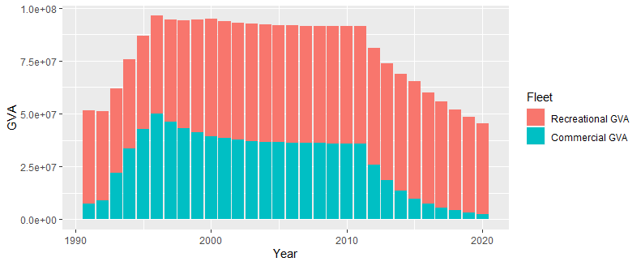

# FiRAM

FiRAM (Fisheries Resource Allocation Model) is an R package to simulate biological and economic effects of commercial and recreational fisheries. The model was initially developed by Tidbury et. al. (2021) for use in Sea Bass fisheries, however the tools presented here are general purpose and can be applied to any fishery where simultaneous management of commercial and recreational fleets is required.
## Installation
You can install the development version of FiRAM using the `devtools` package:
``` r
library(devtools)
install_github("CefasRepRes/FiRAM")
```

## Example

To get started with `FiRAM`, 

``` r
library(FiRAM)

#Load in the params for Sea Bass in the North Sea
data("seabass")

#Change the adult mortality parameter by changing the slot in params.
params@muA <- 0.1

# Specify recruitment as 15 years of high recruitment followed by 15 years of low recruitment
recruitment <- c(rep(23151200, 15), rep(757600, 15))

#Run a simulation
sim <- project(params, R = recruitment, t_start = 1991, t_end = 2020)
```
The `project` function returns a `BioeconomicSim` object encapsulating the model results. We can explore these results by calling different plotting functions.
``` r
plotStock(sim)
#Plot number of commercial trips
plotActivity(sim, fleet = "C")
plotActivity(sim, fleet = "R")
#Plot total economic impact broken down by fleet
plotEconomicImpact(sim, fleet = "T")
```





# Model description

* Include that we've changed the mortality.
